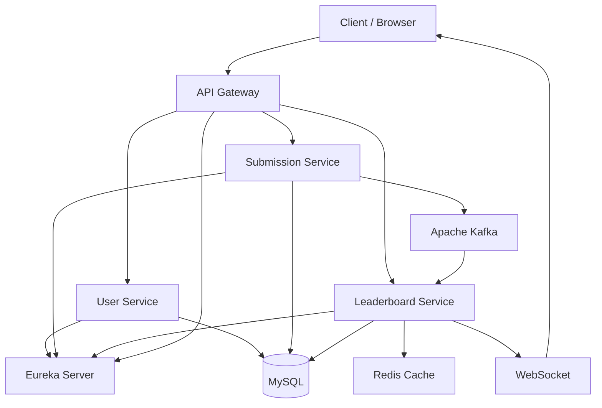
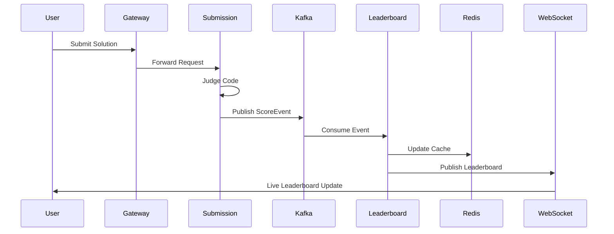

# 🚀 Leaderboard Management System

A distributed **Spring Boot Microservices** application that simulates an online coding platform with secure authentication, coding contests, code submissions, real-time leaderboard updates, and Redis caching.

The system is built using an **event-driven architecture** powered by **Apache Kafka**, with **Spring Cloud Gateway**, **Eureka Service Discovery**, **Redis**, **WebSocket**, **MySQL**, and **Docker**.

---

## ✨ Key Features

- 🔐 JWT Authentication & Role-Based Authorization
- 👤 User Registration & Login
- 🏆 Contest & Problem Management
- 💻 Code Submission with Mock Judge
- 📈 Real-Time Leaderboard
- ⚡ Apache Kafka Event Processing
- 🚀 Redis Leaderboard Caching
- 🔄 WebSocket Live Updates
- 🌐 Spring Cloud Gateway
- 🔍 Eureka Service Discovery
- 🐳 Docker & Docker Compose
- 📚 OpenAPI / Swagger Documentation
- ✅ Unit Testing with JUnit & Mockito

---

# 🛠 Tech Stack

| Category | Technology |
|----------|------------|
| Language | Java 21 |
| Framework | Spring Boot 3 |
| Security | Spring Security + JWT |
| Service Discovery | Netflix Eureka |
| API Gateway | Spring Cloud Gateway |
| Messaging | Apache Kafka |
| Cache | Redis |
| Database | MySQL 8 |
| ORM | Spring Data JPA + Hibernate |
| Real-Time | WebSocket + STOMP |
| Documentation | Swagger / OpenAPI |
| Build Tool | Maven |
| Testing | JUnit 5 + Mockito |
| Containerization | Docker & Docker Compose |


---

# 🏗 Microservices

## User Service

Responsible for:

- User Registration
- User Login
- JWT Token Generation
- Role-Based Authorization
- Admin Initialization

---

## Submission Service

Responsible for:

- Contest Management
- Problem Management
- Code Submission
- Mock Code Judge
- Kafka Event Publishing

---

## Leaderboard Service

Responsible for:

- Kafka Event Consumption
- Best Score Tracking
- Leaderboard Ranking
- Redis Cache
- WebSocket Broadcasting

---

# 🚀 Features

## Authentication

- User Registration
- User Login
- JWT Authentication
- BCrypt Password Encryption
- Role-Based Authorization

## Contest Management

- Create Contest
- Update Contest
- View Contest

## Problem Management

- Create Problem
- Update Problem
- View Problems

## Submission

- Submit Solution
- Mock Code Judge
- Score Calculation
- Submission History

## Leaderboard

- Best Score Tracking
- Rank API
- Redis Caching
- Cache Rebuild
- Cache Clear
- Live Leaderboard Updates

---

# 🏛 System Architecture



---

# 🔄 Submission Flow




---

# 📂 Project Structure

```
Leaderboard-Management-System
│
├── api-gateway
│
├── eureka-server
│
├── userservice
│
├── submission-service
│
├── leaderboard-service
│
├── docker-compose.yml
│
├── .env
│
└── README.md
```


---

# 🎯 Design Principles

The project follows several software engineering best practices:

- SOLID Principles
- DRY (Don't Repeat Yourself)
- Separation of Concerns
- Layered Architecture
- Event-Driven Architecture
- RESTful API Design
- Dependency Injection
- DTO Pattern
- Repository Pattern

---

# 🚀 Getting Started

## Prerequisites

Before running the project, ensure you have the following installed:

- Java 21
- Maven 3.9+
- Docker Desktop
- Git
- MySQL (only for local development without Docker)

---

## Clone the Repository

```bash
git clone https://github.com/<your-username>/Leaderboard-Management-System.git

cd Leaderboard-Management-System
```

---

## Running Locally

### 1. Start Infrastructure

Run Docker Compose:

```bash
docker compose up -d
```

This starts:

- MySQL
- Redis
- Kafka

---

### 2. Start Eureka Server

```bash
cd eureka-server

mvn spring-boot:run
```

---

### 3. Start User Service

```bash
cd userservice

mvn spring-boot:run
```

---

### 4. Start Submission Service

```bash
cd submission-service

mvn spring-boot:run
```

---

### 5. Start Leaderboard Service

```bash
cd leaderboard-service

mvn spring-boot:run
```

---

### 6. Start API Gateway

```bash
cd api-gateway

mvn spring-boot:run
```

The application is now available at

```
http://localhost:8080
```

---

# 🐳 Running with Docker

Build all images

```bash
docker compose build
```

Start all containers

```bash
docker compose up -d
```

Stop all containers

```bash
docker compose down
```

View logs

```bash
docker compose logs -f
```

Rebuild after code changes

```bash
docker compose up --build
```

---

# 📚 API Documentation

Each microservice provides interactive Swagger documentation.

| Service | URL |
|---------|-----|
| User Service | http://localhost:8081/swagger-ui.html |
| Submission Service | http://localhost:8082/swagger-ui.html |
| Leaderboard Service | http://localhost:8083/swagger-ui.html |

JWT authentication can be tested directly from Swagger using the **Authorize** button.

---

# 🧪 Testing

Run unit tests

```bash
mvn test
```

The project includes unit tests covering the service layer using:

- JUnit 5
- Mockito

---

# 📷 Screenshots

> Add screenshots of the following:

- System Architecture
- Swagger UI
- Eureka Dashboard
- Kafka Event Flow
- Redis Leaderboard
- Docker Containers
- Application Demo

---

# 🔮 Future Improvements

- Integrate a real online code execution engine
- Add refresh tokens for JWT authentication
- Implement rate limiting
- Add distributed tracing
- Add CI/CD pipeline using GitHub Actions
- Deploy to AWS using Docker
- Add monitoring with Prometheus and Grafana

---

# 👨‍💻 Author

**Shashwat Sharma**

B.Tech Computer Science Student

Passionate about Backend Development, Microservices, Distributed Systems, and UI/UX Design.

---

# ⭐ Support

If you found this project useful, consider giving it a ⭐ on GitHub.